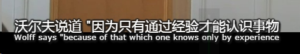

##第二课 宏大的哲学语境
康德的《纯粹理性批判》是其重要著作。这部著作的目的是要证明，虽然我们的知识中没有丝毫能够超越经验，然而有一部分仍旧是先天的，不是从经验按归纳方式推断出来的。我们的知识中先天的那一部分，依他讲，不仅包含逻辑，而且包含许多不能归入逻辑或者由逻辑推演出来的东西，他把莱布尼兹混为一谈的两种区别区分开来。一方面，有“分析命题”与“综合命题”的区别，另一方面，有“先天命题”和“经验命题”的区别。康德说，时间和空间不是概念，由于把空间和时间应用于未经验到的事物会产生种种谬见。让我们追随罗宾逊教授的思路，踏上康德的哲学历程。

亚里士多德的形而上学

基础的本体论问题。
本体论和认识论 之间的关系
分析命题

综合命题 确立其真实度

事实性命题
christian wolff

经验主义追随者

道德的不法性

莱布尼茨

认识四个梯度：
 Does a thing exist?

 It it exists, in what degree does it exist?

 In what relation does it stand to other things?

 And, what is it for?

 如果你接触过Scott Young的整体学习法，体会更加深刻！原来出处在这里！

